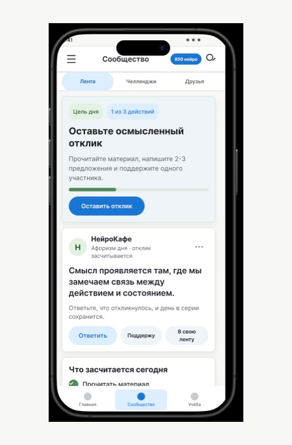

# НейроКафе — UX/UI-концепция социальной сети

Социальная сеть внутри приложения НейроКафе задумана как пространство практики: пользователь читает материал, оставляет осмысленный отклик, поддерживает других участников и видит свой прогресс.

`материал → отклик → поддержка → награда и прогресс → возвращение`

## Результат этапа 2

Подготовлены:

- улучшенные пользовательские сценарии;
- рекомендации по навигации и вовлечению;
- мобильные экраны и обязательные состояния;
- интерактивный прототип в Figma;
- концепция desktop-версии;
- материалы запуска;
- правила модерации;
- сверка решений с ТЗ и стилистикой приложения.

## Основные материалы

1. [Краткий PDF-отчёт](deliverables/2026-07-29-stage2-olga-denis/НейроКафе_Этап_2_краткий_отчет.pdf)
2. [Презентация UX-решений](deliverables/2026-07-29-stage2-olga-denis/presentation.html)
3. [Проверка соответствия ТЗ](deliverables/2026-07-29-stage2-olga-denis/02_Проверка_соответствия_ТЗ.md)
4. [UX-решения и пользовательские сценарии](deliverables/2026-07-29-stage2-olga-denis/03_UX_решения_и_сценарии.md)
5. [Материалы запуска](deliverables/2026-07-29-stage2-olga-denis/04_Материалы_запуска.md)
6. [Регламент модерации](deliverables/2026-07-29-stage2-olga-denis/07_Регламент_модерации.md)
7. [Полный состав пакета](deliverables/2026-07-29-stage2-olga-denis/README.md)

## Прототип

- [Открыть рабочий Figma-файл](https://www.figma.com/design/QE52flPMbhME7do2FquyRY/НейроМир?node-id=0-1)
- [Посмотреть файлы HTML-прототипа](deliverables/2026-07-29-stage2-olga-denis/prototype)

В Figma выберите поток **NeuroCafe Сообщество**.

## Статус

Этап 2 готов к согласованию направления. После обратной связи можно переходить к детальному прототипированию этапа 3.

На согласование вынесены:

- финальные значения наград;
- объём desktop-прототипа;
- доступные данные для персональных вызовов;
- роли и SLA модерации первой недели.
